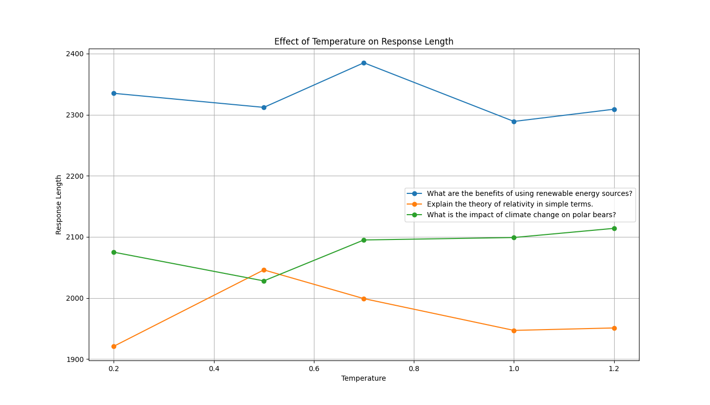
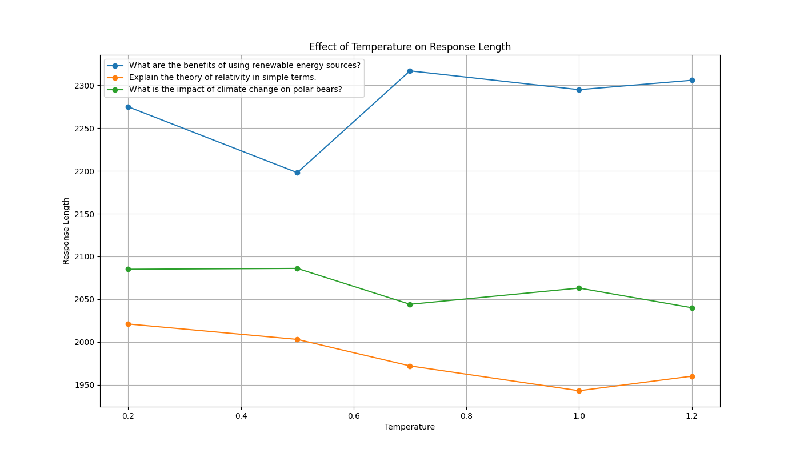
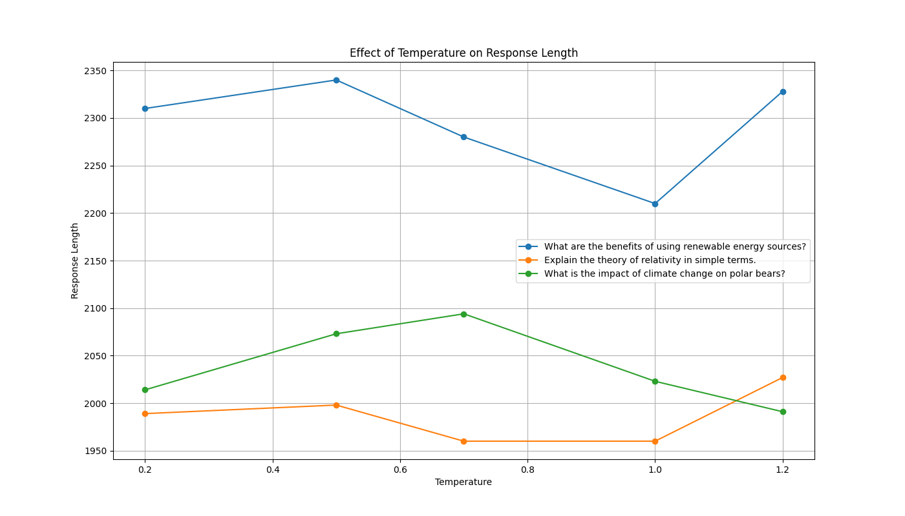
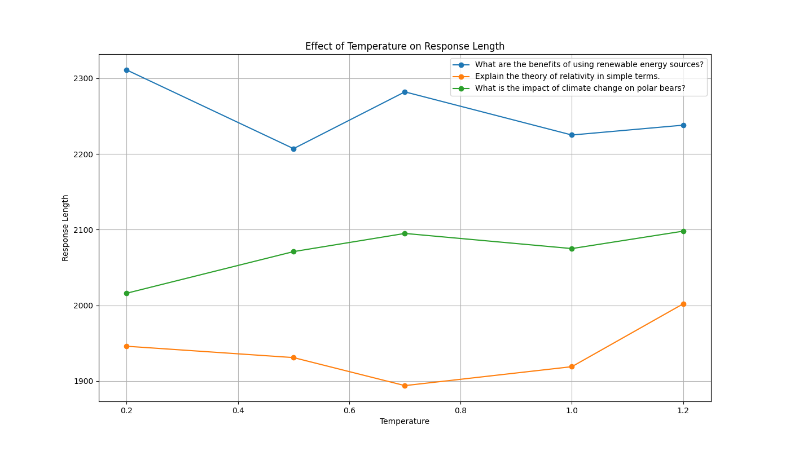
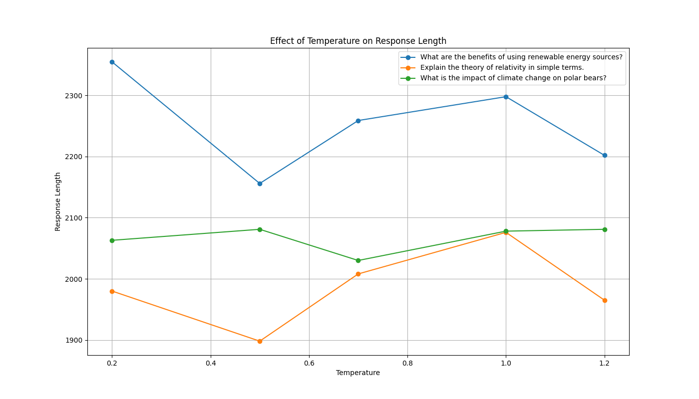
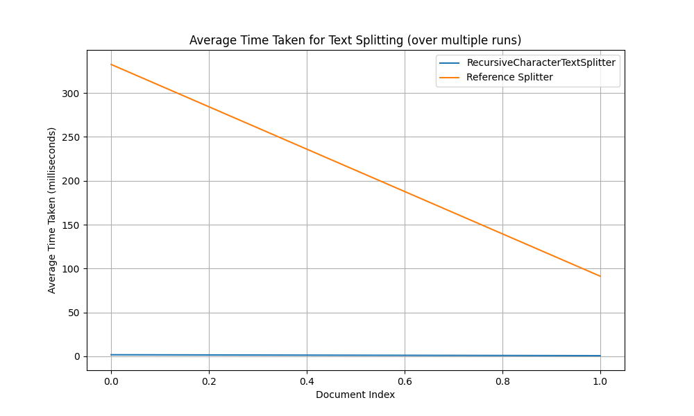
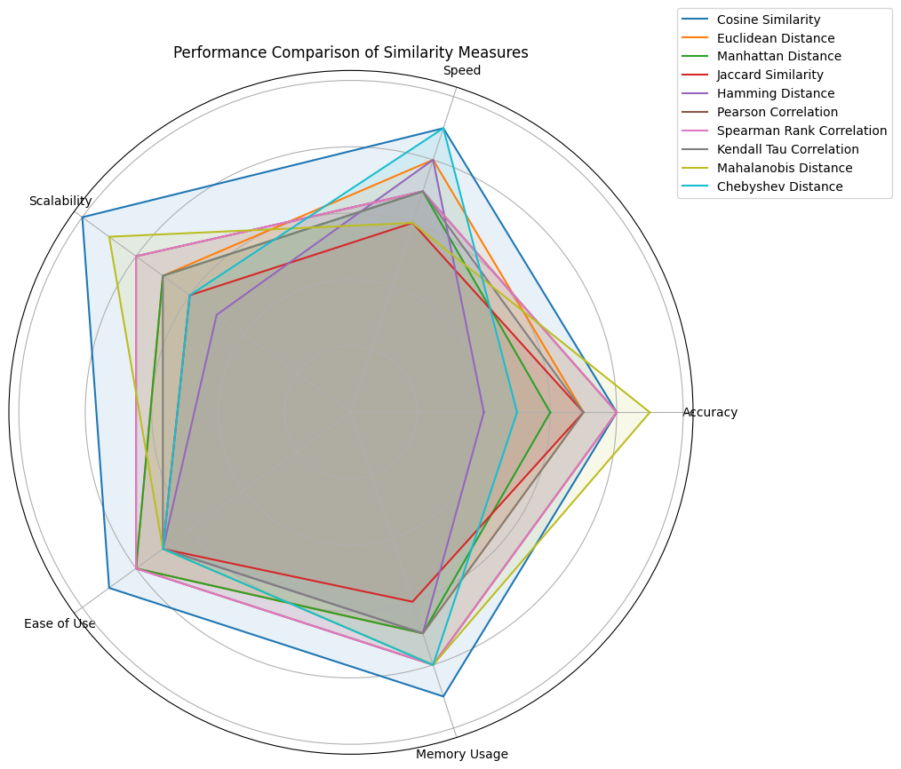

## SA_Bot

This is the SA_Bot project developed by Alvi Rownok and SANDEEP UMASHANKAR PANDEY.

## Project Structure

* `.venv/`: Virtual environment for Python dependencies.
* `SA_Bot/`: Main project folder.
* `.streamlit/`: Streamlit configuration files.
* `__pycache__/`: Python cache files.
* `files/`: Additional project files.
* `sabot/`: Core executable programs.
* `.env`: Environment variables.
* `SAbot.py`: Main bot script.
* `Visual.py`: Visualization script.
* `evaluation/`: Scripts and notebooks for evaluating parameters and models.
* `.env`: Environment variables for evaluation scripts.
* `temperature.py`: Used to evaluate temperature settings in the bot.
* `textsplitter_test.py`: Used to test the text splitting logic.
* `Selection_Test.ipynb`: Jupyter notebook to evaluate and visualize the choice of parameters and models.
* `Test/`: Contains reference documents and test files.
    * `MIT9_00SCF11_text.pdf`: MIT course text.
    * `stephen_hawking_a_brief_history_of_time.pdf`: A Brief History of Time by Stephen Hawking.
    * `william-shakespeare.pdf`: Shakespeare's works.
    * `Costituzione_ENG.pdf`: English translation of the Constitution.
    * `einstein-albert.pdf`: Biography of Albert Einstein.
    * `Ency-Newton.pdf`: Encyclopedia entry on Sir Isaac Newton.
    * `Fellowship of the ring.pdf`: Fellowship of the Ring by J.R.R. Tolkien.
* `poetry.lock`: Poetry lock file for dependencies.
* `pyproject.toml`: Poetry configuration file.
* `*.png`, `*.gif`, `*.xlsx`: Various data and image files.

## Setup Instructions

1. Clone the repository:

```bash
git clone https://github.com/AlviRownok/SAbot-an-LLM-RAG-Assistant.git
cd SA_Bot
```

2. Set up the virtual environment and install dependencies:

```bash
poetry install
```

3. Run the main bot script:

```bash
poetry run python SA_Bot\sabot\SAbot.py
```

4. To start the visualization dashboard after running the main bot script, use:

```bash
poetry run streamlit run Visual.py
```

## Live Demo (Limited Time)

You can experience a live demo of the chatbot at the following link: [https://sabot-an-llm-rag-assistant.streamlit.app/](https://sabot-an-llm-rag-assistant.streamlit.app/)

**Please note:** The live demo will be available only until June 15, 2024, after which it will be closed.

## Evaluation and Testing

The following files are used to evaluate different parameters and models in the main programs:

* `temperature.py`: Used to evaluate temperature settings in the bot.
* `textsplitter_test.py`: Used to test the text splitting logic.
* `Selection_Test.ipynb`: Jupyter notebook to evaluate and visualize the choice of parameters and models.

## Visualization of Evaluation Results

The following images are available in the repository to visualize the evaluation results:

*     
*   

These images can be found in the project repository.

## Contribution Guidelines

* Please submit pull requests for any changes.
* Ensure code is properly documented and tested.
